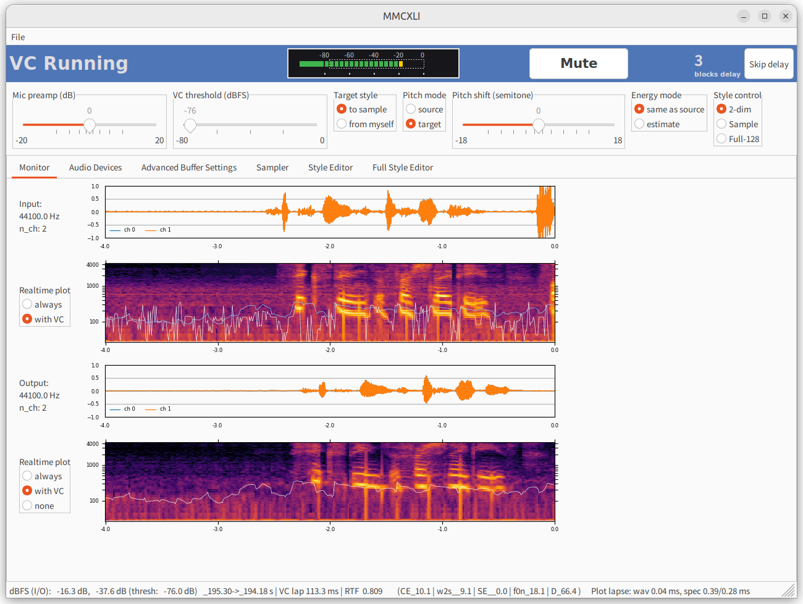

# MMCXLI 

<p align="center">
    
</p>

- [MMCXLI](#mmcxli)
  - [About](#about)
  - [License](#license)
    - [Notice](#notice)
  - [Install](#install)
    - [Checkpoints](#checkpoints)
  - [Launch](#launch)
    - [Usage](#usage)
    - [Exit](#exit)
  - [Settings](#settings)
    - [Audio devices](#audio-devices)
  - [Model](#model)
  - [Sources](#sources)
      - [音声関連](#音声関連)
      - [設定関連](#設定関連)
      - [主処理](#主処理)
      - [プロット](#プロット)
      - [文書](#文書)
      - [サンプラー](#サンプラー)
      - [話者スタイル編集](#話者スタイル編集)
      - [ユーティリティ関数](#ユーティリティ関数)
      - [VC 管理](#vc-管理)
    - [スタイル格納フォルダ](#スタイル格納フォルダ)
    - [ログフォルダ](#ログフォルダ)

詳細な使い方は[設定方法](./docs/settings_guide.md)を参照ください。

## About

MMCXLI は連続潜在空間ベースの any-to-any voice conversion の研究を目的として、
概念実証のために試作されたリアルタイム声質変換クライアントです。読み方は「ぶいしい」です。

声質変換の機能を GUI（wxPython）から使用可能です。プログラムは Python のスクリプトとして提供されており、起動にはローカルマシンへの Python のインストールが必要です。

Any-to-any なのでユーザー自身が音声データを用意して学習を行う必要はありません。操作画面上で座標をクリックして、変換先の声質を選ぶだけです。

リアルタイム変換には Nvidia 製のミドル～ハイエンド GPU が必要です。GeForce RTX 2080 SUPER で遅延量を大きくして何とか、3090 であれば余裕で動作します。VRAM は最低 4 GB ないとアプリケーションを起動できません。

実際の声質変換に用いられる深層学習モデルは ONNX 形式ファイルとして、[同一作者による別のプロジェクト "ClassicVC"](https://github.com/lyodos/classic-vc) で配布されますので、ダウンロードして所定のサブフォルダに配置してください（[インストール](#install-インストール)の項目を参照）。モデルに関する情報は当該リポジトリを参照ください。

外部との通信を一切行わず、使用するマシンの音声入出力デバイスにのみアクセスします。

Windows 11 Professional および Ubuntu 22.04 LTS でテストされています。原理的には ONNX Runtime がサポートされる他のプラットフォーム上でも動作しますが、ユーザー自身によるバグ取りが要求されます。

GUI の表示には少なくとも横 1280 px、縦 960 px 以上のディスプレイ解像度が必要です。

----

## License

MMCXLI は開発者である Lyodos 個人が、非営利の研究目的で作成した著作物です。MMCXLI リポジトリの全体は MIT License を唯一の規約としてリリースされます。

>The MIT License
>
>Copyright (c) 2024 Lyodos
>
>Permission is hereby granted, free of charge, to any person obtaining a copy of this software and associated documentation files (the "Software"), to deal in the Software without restriction, including without limitation the rights to use, copy, modify, merge, publish, distribute, sublicense, and/or sell copies of the Software, and to permit persons to whom the Software is furnished to do so, subject to the following conditions:
>
>The above copyright notice and this permission notice shall be included in all copies or substantial portions of the Software.
>
>THE SOFTWARE IS PROVIDED "AS IS", WITHOUT WARRANTY OF ANY KIND, EXPRESS OR IMPLIED, INCLUDING BUT NOT LIMITED TO THE WARRANTIES OF MERCHANTABILITY, FITNESS FOR A PARTICULAR PURPOSE AND NONINFRINGEMENT. IN NO EVENT SHALL THE AUTHORS OR COPYRIGHT HOLDERS BE LIABLE FOR ANY CLAIM, DAMAGES OR OTHER LIABILITY, WHETHER IN AN ACTION OF CONTRACT, TORT OR OTHERWISE, ARISING FROM, OUT OF OR IN CONNECTION WITH THE SOFTWARE OR THE USE OR OTHER DEALINGS IN THE SOFTWARE.
>
>以下に定める条件に従い、本ソフトウェアおよび関連文書のファイル（以下「ソフトウェア」）の複製を取得するすべての人に対し、ソフトウェアを無制限に扱うことを無償で許可します。これには、ソフトウェアの複製を使用、複写、変更、結合、掲載、頒布、サブライセンス、および/または販売する権利、およびソフトウェアを提供する相手に同じことを許可する権利も無制限に含まれます。
>
>上記の著作権表示および本許諾表示を、ソフトウェアのすべての複製または重要な部分に記載するものとします。
>
>ソフトウェアは「現状のまま」で、明示であるか暗黙であるかを問わず、何らの保証もなく提供されます。ここでいう保証とは、商品性、特定の目的への適合性、および権利非侵害についての保証も含みますが、それに限定されるものではありません。作者または著作権者は、契約行為、不法行為、またはそれ以外であろうと、ソフトウェアに起因または関連し、あるいはソフトウェアの使用またはその他の扱いによって生じる一切の請求、損害、その他の義務について何らの責任も負わないものとします。

### Notice

リアルタイム声質変換は、個人の属性を縛る代表的な枷の一つである「声色」から人類を解放することで、自己実現や人権保護に多大な貢献が期待される技術です。
この技術の到来を切実に求める人々が存在しており、私たちはその声に応えるべく、オープンで民主的な生成 AI の運用を目指して夜な夜な活動しています。
しかしながらディープフェイクや詐欺等への悪用が潜在的に可能な、いわゆるデュアルユース技術でもあり、使用には責任が伴います。
本リポジトリの構成物の全てもしくは一部を利用した時点で、ユーザーは上記の MIT License を受諾し、その定めるところである作者の無制限の免責に同意したものとみなされます。

本プログラムは声質変換の基礎研究の一環として趣味で試作されたものであり、動作の確実性やリアルタイム性をいっさい保証しません。現時点では残念ながら実用段階に達しておらず、ソースコードの公開によってコミュニティでの検証を受けるべきであると、開発者は認識しています。インターネット配信等の不特定多数を対象とする場面での使用および、医療・交通・インフラ・兵器システム等を含むミッションクリティカルな用途については、明文化された唯一の規約として MIT License を採用する以上、開発者として禁止はできませんが積極的な推奨もしません。

MMCXLI を用いて声質変換を実行するために必要な機械学習モデルおよびその重みには、それらを配布するリポジトリが別途定めるライセンスが適用されます。これらは MMCXLI リポジトリの構成要素ではありません。

MMCXLI の Python 環境上での実行時に、動的に読み込まれる外部ライブラリには、各ライブラリの開発者が別途定めるライセンスが適用されます。

声質変換の原理を含む詳細なモデルの説明、深層学習モデルの訓練に用いたデータセットの内訳については、MMCXLI リポジトリの取り扱う範囲外です。これらはもっぱら[同一作者による別のプロジェクト "ClassicVC"](https://github.com/lyodos/classic-vc) で所管します。MMCXLI リポジトリの Issue 等での問い合わせや取材にはいっさい応じませんので、当該のリポジトリにある解説を参照ください。

Version 1.0.0 の公開後、このリポジトリは縮小営業に入ります。新たな機能は追加しない予定です。
また環境依存のバグについてのマージには対応できない可能性が高いです。
機能上の要望がある方は、各自でフォークしてください。
MIT License の定めるところにより、ユーザーは原開発者以外の者に、有償無償を問わずプログラムの改良を依頼することができます（要するに他でやってくれということです）。

----

## Install

以下の手順は Windows でも Linux デスクトップ環境でもほぼ同一です。

1. CUDA および cuDNN をインストールし、ローカルマシン上の GPU が認識されていることを `nvidia-smi` コマンド等で確認します。この際、[ONNXRuntime と互換性のあるバージョンの CUDA をインストールしてください](https://onnxruntime.ai/docs/install/)。

2. Python をインストールします。開発者は 3.11.9 で検証しています。

3. 本リポジトリを `git clone` ないし zip でダウンロードし、リポジトリのコピーをマシン上の適当なフォルダに展開・配置します。
このとき、フォルダ名に日本語やその他マルチバイト文字を含まないようにしてください。

4. `requirements.txt` にあるとおり、以下の Python パッケージを pip でインストールします（conda 環境は未検証です）。

```
librosa
matplotlib
numpy
onnxruntime_gpu
pydub
sounddevice
soundfile
wxPython
```

* なお pydub を使用するには（Python 外で） ffmpeg をマシンにインストールし、パスを通す必要があります。一般的なインストール方法に従ってください。ただしオフライン処理（非リアルアイム声質変換：後述）を使用し、かつ mp3, m4a, opus 形式の音声ファイルを変換に用いたい場合のみ ffmpeg を参照しますので、不要ならば ffmpeg はインストールしなくても最低限動作します。

* `venv` 等の仮想環境を使うと、Python 環境上の他の開発プロジェクトとのバージョン競合を避けられるので便利です。一方で「仮想マシン」は、USB マイク等の音声機器が正常に認識されない、あるいは遅延が大きくなる可能性があるので、非推奨です。
WSL2 でも工夫して音声入出力を通せば使えるかもしれませんが、ホストに Python をインストールする方が圧倒的に楽でしょう。

### Checkpoints

5. ["ClassicVC" 声質変換モデルのリポジトリから ONNX 形式のモデルファイルをダウンロードし](https://github.com/lyodos/classic-vc/README.md#ONNX)、このリポジトリのルートフォルダ内の `weights` フォルダ（無ければ作成）に配置してください。必要な ONNX ファイルは以下のとおりです。

```pre
(.) この readme.md があるローカルフォルダ
"./weights/harmof0.onnx"                    (5.65 MiB)   16 kHz 音声から基本ピッチ（F0）、音量、およびスペクトログラムを抽出する
"./weights/hubert500.onnx"                  (360 MiB)    16 kHz 音声から発話内容を抽出する
"./weights/style_encoder_304.onnx"          (176 MiB)    （ターゲットの）スペクトログラムを入力に取り、話者スタイルを抽出する
"./weights/f0n_predictor_hubert500.onnx"    (115 MiB)    発話内容とターゲットの話者スタイルをもとに、基本ピッチ（F0）と音量を推定する
"./weights/decoder_24k.onnx"                (212 MiB)    発話内容、ターゲットの話者スタイル、F0、音量をもとに 24 kHz 音声を合成する
"./weights/pumap_encoder_2dim.onnx"         (4.26 MiB)   話者スタイルベクトルを 128 次元から（手動編集に適した） 2 次元に圧縮する
"./weights/pumap_decoder_2dim.onnx"         (16.3 MiB)   話者スタイルベクトルを 2 次元から 128 次元に伸長する
```

* 容量等の都合で ONNX ファイルの配置場所を変えたい場合は、`configs` フォルダの `vc_config.json` に記載されているリンクを修正してください。`main.py` からの相対パスになっています。

* 声質変換用のモデルは、もともと PyTorch で開発したものを ONNX 形式に変換して配布しています。本リポジトリの構成物を用いて声質変換を実行する一般ユーザーにおいては、PyTorch のインストールは不要です。


----


## Launch

1. コマンドライン（Python インタプリタではなくマシンにインストールされているコマンド実行環境のこと）を開き、リポジトリ内容を配置したルートフォルダ、すなわちこの `readme.md` や `main.py` 等がある場所が作業ディレクトリになるよう cd 等で移動してください。

* もし venv 等の環境に上記の requirements をインストールした場合は、その仮想環境をアクティベートしてください。

2. コマンドラインで以下のいずれかを入力し、エンターキーを押してください。

```python
python main.py
```

もしくは

```python
python3 main.py
```

3. 声質変換アプリケーションの GUI ウィンドウが開きます。
ただし初回起動時は数十秒を要します。これは初回起動時、`sounddevice` モジュールを用いて、マシンに接続されている音声入出力デバイスの一覧を作成しているためです。

4. 数十秒間待ってもウィンドウが開かない場合は、必要なパッケージの不足等により、起動プロセスの途中でエラーが発生している可能性があります。
この場合、起動直後からのアプリケーションの動作ログが `./logs/` サブフォルダの `app_latest.log` というファイルに記録されていますので、原因を特定できる可能性があります。

* ただし`app_latest.log` にはマシンの現在のユーザー名や絶対パスといった、個人を特定できる情報が記録されることがあります。外部の者に対して丸ごと公開することは危険です。

5. 起動に用いたコマンドライン画面は、（GUI のウィンドウが立ち上がった後でも）アプリケーションの使用中は閉じないでください。


### Usage


詳細な使い方は[設定方法](./docs/settings_guide.md)を参照ください。


### Exit

以下のいずれかで終了させてください。

1. アプリケーションのメニューの「ファイル」から「終了」

2. アプリケーションウィンドウがフロントにある状態で Ctrl + Q キーを同時に押す

3. アプリケーションウィンドウの×ボタンを押す

4. 起動に用いたコマンドライン上で Ctrl + C キーを同時に押す

ただし、特に Windows ではそれなりの時間（数十分以上）起動させ続けると、
1 から 3 までの「まっとうな」終了方法ではアプリケーションが閉じなくなる不具合が判明しています。
この場合、4 の Ctrl + C の方法で大体は対処できます。

アプリケーションの実行中にあまりに長く処理落ちフレームが続いたりすると、コマンドラインからの Ctrl + C でもプロセスを終了できなくなることがあります。この場合は以下の方法を順番に試して、強制的にプロセスを落とします。

5. Ctrl + C を押してもアプリケーションウィンドウが閉じない場合、Windows の画面下側のタスクバーで MMCXLI のタスクウィンドウを、数秒間隔で 2 回クリックする（つまり最小化することで、ゾンビと化したウィンドウの削除イベントを強制的に発火させる）。

6. `python main.py` を評価させた冒頭、コマンドライン上にこのプロセスの ID が表示される。これをタスクマネージャから探して、該当する Python.exe を「タスクの終了」。

----

## Settings

VC 設定はアプリケーションウィンドウ内のスライダーやスイッチから操作できます。
それぞれの画面における操作パネルの意味については、[設定方法](./docs/settings_guide.md)を参照ください。

またアプリケーション起動時にロードされる設定値を変更したい場合は、
`./configs/` サブフォルダの `vc_config.json` および `app_config.json` を適当なエディタで開いて値を編集してください。
ただしこれらの json ファイルは、アプリケーションの初回起動時に自動生成されるため、最初は存在しないことがあります。
なお GUI から設定できる項目については、アプリケーション画面上で変更した後でウィンドウ左上のメニューから上書きすることもできます。

これらの `vc_config.json` および `app_config.json` について、ファイルを削除した場合は次回起動時に自動で再作成されます。
ただし、自分が設定し直したユーザーデフォルト設定がリセットされ、いわゆる factory default に戻ります。
なので設定ファイルは手動で別のフォルダにコピーする等の方法により、バックアップを取ることを推奨します。

なお factory default の値は `config_manager.py` というスクリプトファイルに格納されています。
このスクリプトは設定ファイルを自動再生成する内部機能を提供しており、設定値をカスタマイズする目的でのユーザーによる編集は想定していません。


### Audio devices

 `./configs/` サブフォルダの `StrictDeviceInfo-xxxx.json` （ただし xxxx は PC 名を MD5 でハッシュ化した文字列）に、マシン上で Python 環境から認識されている音声入出力デバイスの一覧が記録されます（これもアプリケーションを起動するまで生成されません）。

この `StrictDeviceInfo-xxxx.json` ファイルは誤って削除しても、次の起動時に自動で再作成されるので問題ありません。

マシンの音声入出力デバイス（マイク、ヘッドフォン等）やディスプレイを繋ぎ直した場合、 `StrictDeviceInfo-xxxx.json` を削除してからアプリケーションを起動してください。最新の音声デバイス構成が再スキャンされます。

現在のアプリケーションの仕様では起動時に、OS が指定するデフォルトの音声処理 API とデフォルトの音声デバイスが自動で選択されます。また、そのデバイスがデフォルトとするサンプリング周波数（44100 Hz もしくは 48000 Hz が一般的）が設定されます。

デバイスを変更したい場合、アプリケーションの起動後に、ウィンドウ内の Device タブから選択してください。

アプリケーションの Device タブには、起動後に音声処理 API を動的に変更できるラジオボタンもあります。ただしとりわけ WASAPI と他の API との切り替え時に、アプリケーションのクラッシュを引き起こす場合があるため、API の変更は推奨しません。

サンプリング周波数をユーザーが動的に変更する方法は用意していません。
一旦起動した VC エンジンのサンプリング周波数を後から変更しようとすると、内部変数をほとんどすべて書き換える必要があり、
現実的でないためです。

----


## Model

声質変換の原理を含む詳細なモデルの説明、深層学習モデルの訓練に用いたデータセットの内訳については、MMCXLI リポジトリの取り扱う範囲外です。これらはもっぱら[同一作者による別のプロジェクト "ClassicVC"](https://github.com/lyodos/classic-vc) で所管します。MMCXLI リポジトリの Issue 等での問い合わせや取材にはいっさい応じませんので、当該のリポジトリにある解説を参照ください。

音声変換の流れについては `vc_engine.py` にある AudioEfx クラスの `inference` メソッド、および `convert_offline` メソッドも参照ください。前者はリアルタイム変換用に短時間の音声チャンクを入力して変換結果を接続します。後者は音声ファイル全体を使って声質変換を行います（注意：上限秒数を設定しており、それより長いファイルは冒頭のみ処理されます）。


アプリケーション起動時に読み込まれる ONNX ファイルのパスは `vc_config.json` を通じて編集できます。
入出力テンソルの形式さえ合致すれば、あなたが自分でモデルを訓練して重みを差し替えることが可能です。

----

## Sources

以下は、VC クライアント自体の改造や自前プロジェクトへの組み込みを企図される開発者のための、発展的な情報です。

通常のアプリケーションの使用方法については[設定方法](./docs/settings_guide.md)を参照ください。

```
.
├── __init__.py
├── __pycache__
...
├── audio_backend.py
├── audio_device_check.py
├── audio_device_manager.py
├── audio_level_meter.py
├── config_manager.py
├── configs
│   ├── StrictDeviceInfo-xxxx.json (xxxx is the md5 of your machine name)
│   ├── app_config.json
│   ├── vc_config.json
│   └── vc_config.json.bak
├── docs
│   ├── HISTORY.md
...
│   └── settings_guide.md
├── images
│   └── emb_dim_01.png
├── logs
│   ├── app_latest.log
│   └── handmade_style_latest.log
├── main.py
├── plot_content.py
├── plot_spectrogram.py
├── plot_waveform.py
├── README.md
├── requirements.txt
├── sample_manager.py
├── sample_player_widgets.py
├── sample_slot.py
├── style_editor.py
├── style_full_manager.py
├── style_manager.py
├── style_slot.py
├── styles
│   ├── a.csv (the saved style vector for each voice style)
│   ├── b.csv
...
│   ├── sample_portfolio.json
│   ├── style_portfolio.json
...
├── utils.py
├── vc_advanced_settings.py
├── vc_control_widgets.py
├── vc_engine.py
├── vc_monitor_widgets.py
└── weights
    ├── decoder_24k.onnx
    ├── f0n_predictor_hubert500.onnx
    ├── harmof0.onnx
    ├── hubert500.onnx
    ├── pumap_decoder_2dim.onnx
    ├── pumap_encoder_2dim.onnx
    └── style_encoder_304.onnx

```

#### 音声関連

* `audio_backend.py`

    GUI を持たない `SoundControl` クラスを定義します。音声入出力デバイスとの間のストリームの管理や、コールバックによる VC エンジンの呼び出し等のバックエンド機能を一手に引き受けます。`main.py` から呼ばれます。

* `audio_device_check.py` 

    これも GUI を持たず、`audio_backend.py` から呼ばれます。Python の sounddevice パッケージを用いて、音声入出力デバイスのフルスキャンを実行するための関数を定義します。

* `audio_device_manager.py`

    アプリケーションにおいて音声 API および入出力デバイスを動的に変更するための操作パネル（`SoundIOChoice` クラス）、およびストリームの blocksize を動的に変更するためのスライダー（`BlockRollPanel` クラス）を定義します。`main.py` から呼ばれます。

* `audio_level_meter.py`

    入力音声レベルを dBFS スケールでリアルタイムにプロットする部品（`InputLevelMeterPanel` クラス）を定義します。`vc_control_widgets.py` で定義する `FloatPanel` クラスから呼ばれます。

#### 設定関連

* `config_manager.py`

    アプリケーションの起動時設定（`vc_config.json` および `app_config.json`）を、初回起動時、およびユーザーが削除した場合に自動で再生成するスクリプトです。`main.py` から呼ばれます。一般ユーザーが設定を変更する場合は、ここではなく `vc_config.json` および `app_config.json` を書き換えてください。

#### 主処理

* `main.py`

    最初に評価され、アプリケーションの画面初期化とメインループの保持、`SoundControl` を通じた音声入出力ストリームの起動、その他各種部品の初期化を行います。

#### プロット

* `plot_content.py`

    ContentVec による発話内容の抽出結果（768 次元のテンソル）を、リアルタイムでプロットする `PlotEmbeddingPanel` クラスを定義します。`main.py` から呼ばれますが、基本的に開発テスト用の機能であり現在は `app_config["display_content"]` フラグで無効化されています。

* `plot_spectrogram.py`

    入力音声および変換後の出力音声について、対数スペクトログラムに変換したデータを、リアルタイムでプロットする `PlotSpecPanel` クラスを定義します。`vc_monitor_widgets.py` 内で定義される `MonitorWidgets` から呼ばれます。

* `plot_waveform.py`

    入力および出力音声の波形をリアルタイムでプロットする `PlotWaveformPanel` クラスを定義します。`PlotSpecPanel` クラスと同様に、`vc_monitor_widgets.py` 内で定義される `MonitorWidgets` から呼ばれます。


#### 文書

* `readme.md`

    このファイルです。

* `requirements.txt`

    Python 依存パッケージの一覧です。

#### サンプラー

* `sample_manager.py`

    アプリケーションウィンドウ上で音声サンプルを登録した複数のスロットを作成し、マウスでクリックして再生サンプルを切り替える機能を提供する、`SampleManagerPanel` クラスを定義します。予め録音しておいたセリフを、スロットに登録して流す、いわゆる「ポン出し」に使います。 `SoundControl` クラスのインスタンスにキューで送信されることで音声出力されるため、ここで再生する音声には VC が適用されます。`main.py` から呼ばれます。

* `sample_player_widgets.py`

    上において、選択したスロットの音声を再生するための制御ボタンとスライダーを定義する `SamplePlayerWidgets` クラスを定義します。 `sample_manager.py` から呼ばれます。

* `sample_slot.py`

    音声サンプルをロードするためのスロットである、`AudioSlotPanel` クラスを定義します。複数のスロットが存在するため、それらを統括する `sample_manager.py` から呼ばれます。

#### 話者スタイル編集

* `style_editor.py`

    本来は 128 次元である話者スタイルベクトルを 2 次元の潜在空間に縮約表示し、画面上でクリックして変換先スタイルを選択できる `AxesEditPanel` クラスを定義します。スタイル管理のルートである `style_manager.py` から呼ばれます。

* `style_full_manager.py`

    128 次元の話者スタイルベクトルをスライダーで個別に編集できる、マゾヒスト御用達の `FullManagerPanel` クラスを定義します。`main.py` から呼ばれます。

* `style_manager.py`

    話者スタイルを格納した複数のスロットを作成し、マウスでクリックして変換先スタイルを切り替える機能を提供する、`StyleManagerPanel` クラスを定義します。 `main.py` から呼ばれます。

* `style_slot.py`

    アプリケーションウィンドウ上で話者スタイルを記録するためのスロットである、`StyleSlotPanel` クラスを定義します。複数のスロットが存在するため、それらを統括する `style_manager.py` から呼ばれます。

#### ユーティリティ関数

* `utils.py`

    プロットや指標値の計算のための、共通の補助関数を定義します。

#### VC 管理

* `vc_advanced_settings.py`

    VC 変換処理における各種特徴量を計算する際の、チャンクサイズを詳細に制御する `AdvancedSettingsPanel` を定義します。チャンクが長いほど出力音声の品質が向上しますが、計算時間や VRAM の要求量が増えます。 `main.py` から呼ばれます。

* `vc_control_widgets.py`

    アプリケーションウィンドウ上でタブを切り替えても、常に基本的な変換設定を上部に表示し続ける `FloatPanel` クラスを定義します。 `main.py` から呼ばれます。なお、この常時表示パネルに音声ファイルをドラッグ・アンド・ドロップすることで、非リアルタイムの声質変換を実行し、ソース音声がある場所のサブフォルダに変換後音声を wav ファイルで保存できます。

* `vc_engine.py`

    GUI を持たない VC 推論エンジンである `AudioEfx` クラスを定義します。ONNX ネットワークを読み込んで推論セッションを作成し、`inference` メソッドでは短時間の音声チャンクを入力してリアルタイム変換を実行します。一方 `convert_offline` メソッドでは、与えられた音声ファイル全体を使って非リアルタイムの声質変換を行います。`audio_backend.py` から呼ばれ、`SoundControl` クラスの `efx_control` 要素として、しばしば他の場所から参照されます。

* `vc_monitor_widgets.py`

    入出力音声を波形および対数スペクトログラムで表示する、`MonitorWidgets` クラスを定義します。 `main.py` から呼ばれます。

### スタイル格納フォルダ

```
├── styles
│   ├── a.csv
│   ├── b.csv
...
│   ├── sample_portfolio.json
│   ├── style_portfolio.json
```

`styles` フォルダには、要素数 128 の話者スタイルベクトルが csv 形式で格納されます。これらは `StyleManagerPanel` からロードして声質変換に用いることができます。なお要素数が 128 でない csv ファイルをロードしようとすると警告ダイアログが出て、読み込みは実行されません。

`sample_portfolio.json` は、前回のアプリケーション起動中にスロットに読み込んだ音声ファイルの一覧を記録します。
現在のところ、アプリケーション起動時の計算量を節約するために、前回読み込んだファイルを自動で再ロードする機能は実装していません。

`style_portfolio.json` は、前回のアプリケーション起動中にスロットに読み込んだスタイルの一覧を記録します。128 次元のスタイルベクトルおよび、手動でパネル上で入力した 2 次元の縮約表現の座標が記録されています。
アプリケーションを起動すると、前回の最終状態が復元されるはずです（バグを除去できた自信がない）。

なお、`styles` サブフォルダ以下のファイルは、ユーザーが任意に削除できます。次回起動時に自動で空の json ファイルが再作成されます。

### ログフォルダ

```
├── logs
│   ├── app_latest.log
│   └── handmade_style_latest.log
```

`logs` フォルダに含まれる `app_latest.log` は、アプリケーション起動中のデバッグ情報や警告等を logging で記録したものです。
ユーザーによって削除された場合、次回起動時に再作成されます。

アプリケーション開発時に `style_manager.py` を単体テストすることが可能です。このとき `handmade_style_latest.log` が作成され、ログが記録されます。

各ログファイルも、自由に削除して構いません。


----