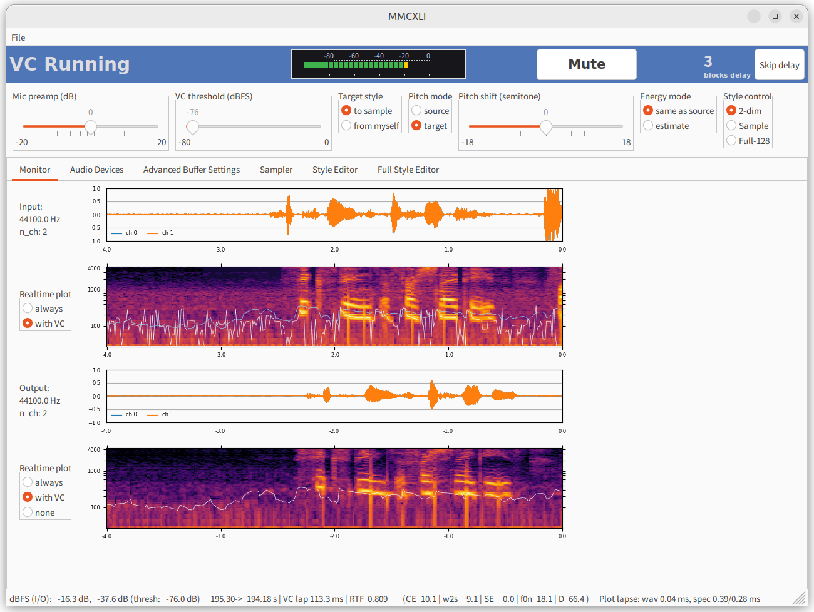
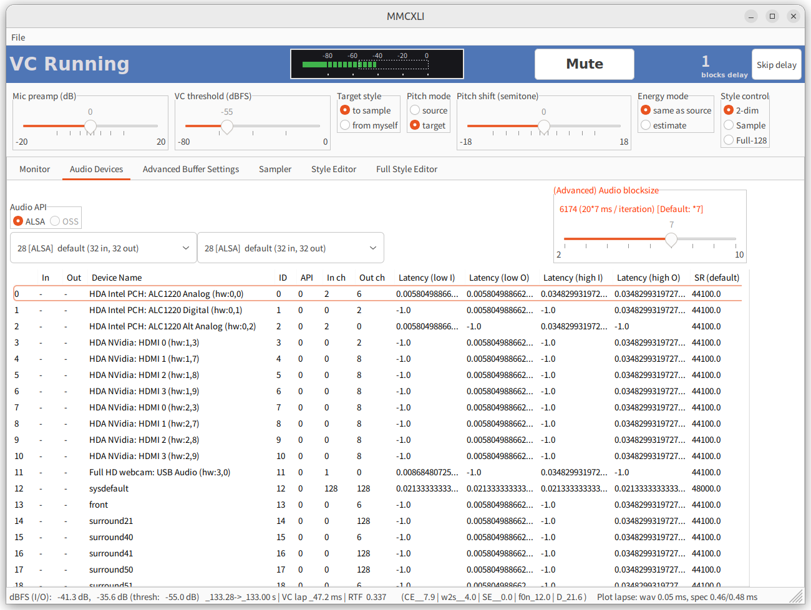
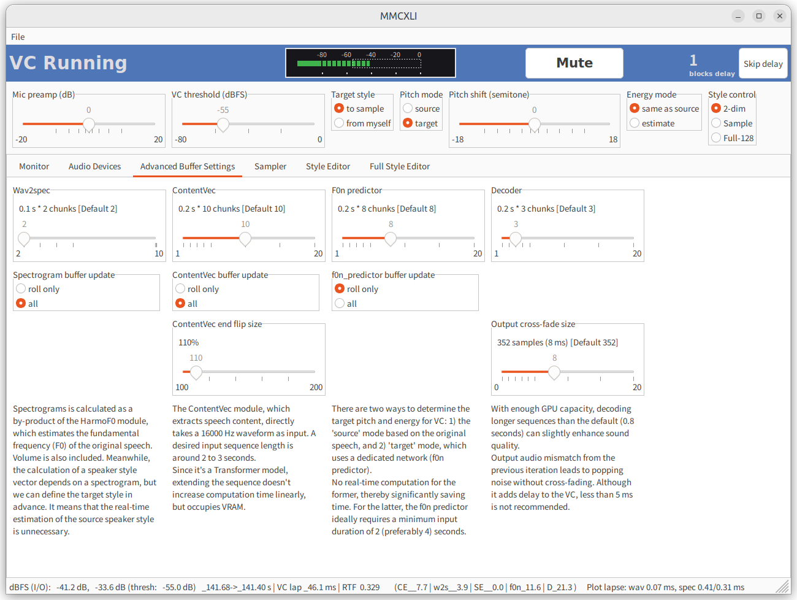
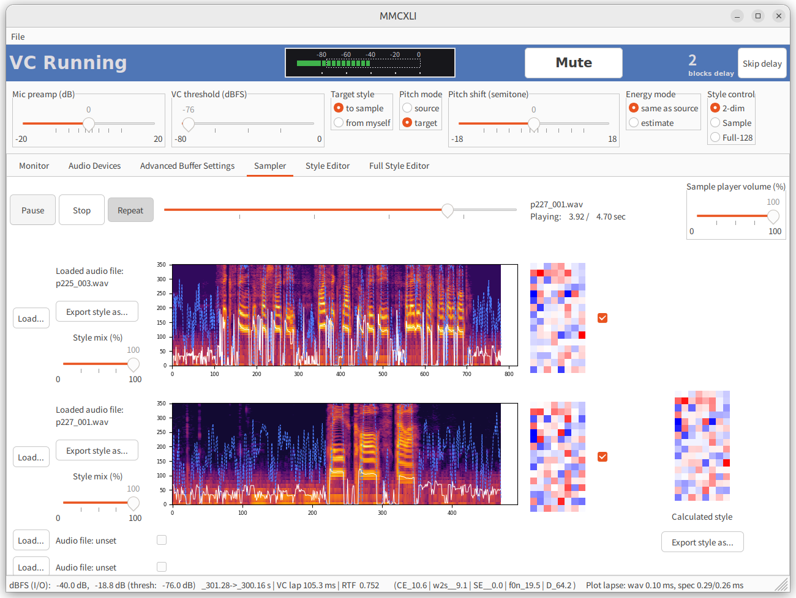
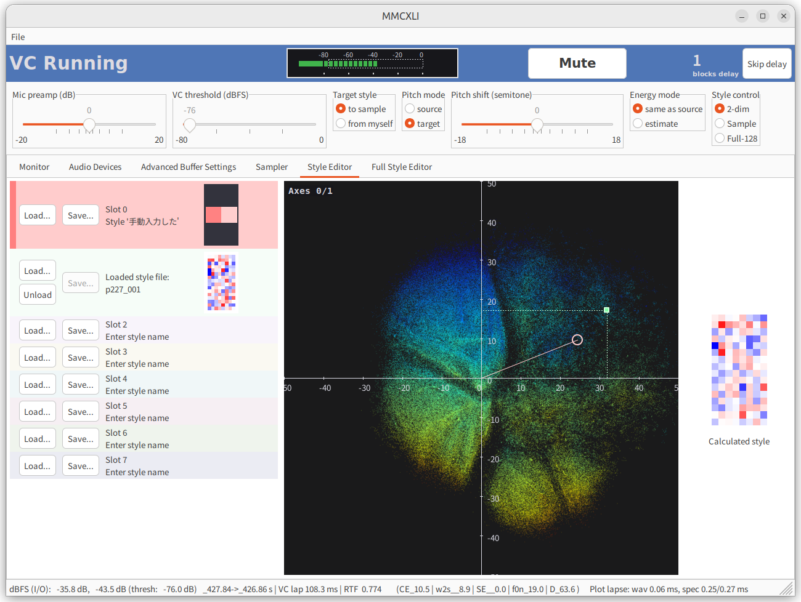
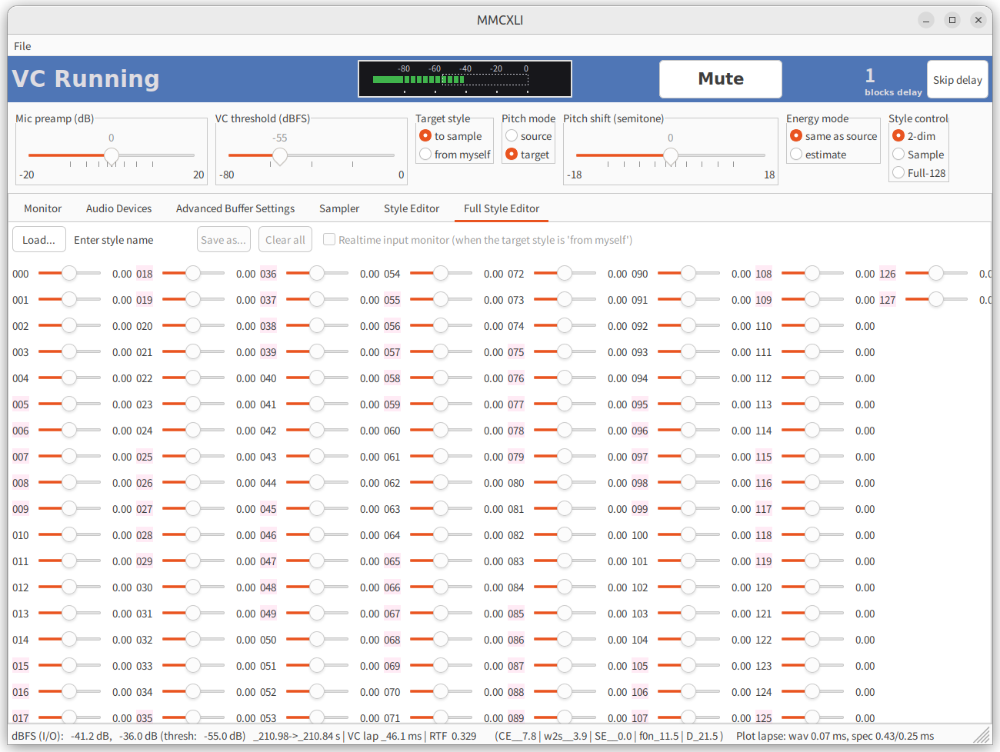

# MMCXLI Settings Guide

> Version 1.0.0 (2024-07-31)

- [MMCXLI Settings Guide](#mmcxli-settings-guide)
  - [基本的な画面構成](#基本的な画面構成)
    - [Monitor Tab（モニター）](#monitor-tabモニター)
      - [「状態表示パネル」（図の青帯の部分）](#状態表示パネル図の青帯の部分)
      - [（非リアルタイム）ファイル変換](#非リアルタイムファイル変換)
      - [「基本 VC 設定パネル」（青帯の下にあるスライダー類）](#基本-vc-設定パネル青帯の下にあるスライダー類)
    - [Audio Device Settings Tab（音声デバイス設定）](#audio-device-settings-tab音声デバイス設定)
      - [Audio block size のこと](#audio-block-size-のこと)
    - [Advanced Buffer Settings Tab （発展的：バッファサイズ設定）](#advanced-buffer-settings-tab-発展的バッファサイズ設定)
    - [Sampler Tab （サンプラー）](#sampler-tab-サンプラー)
    - [Style Editor Tab （スタイル編集）](#style-editor-tab-スタイル編集)
    - [Full Style Editor Tab （フル次元スタイル編集）](#full-style-editor-tab-フル次元スタイル編集)
  - [GUI 上で未サポートの基本設定](#gui-上で未サポートの基本設定)
    - [`app_config.json`](#app_configjson)
    - [`vc_config.json`](#vc_configjson)


----

## 基本的な画面構成


標準状態では、MMCXLI のアプリケーションウィンドウは 6 枚のタブで構成される。
またタブの表示状態に関わらず、ウィンドウの上側には「状態表示パネル」（図の青帯の部分）および「基本 VC 設定パネル」（青帯の下にあるスライダー類）が表示される。

<p align="center">
    
</p>

### Monitor Tab（モニター）

起動直後はモニタータブが前面表示される。4 枚の時系列プロットが含まれ、上から順に

* 入力音声、波形

* 入力音声、対数スペクトログラム

* 出力音声、波形

* 出力音声、対数スペクトログラム

を表す。音声からスペクトログラムへの変換（STFT）は高負荷であるため、入力音声の音量レベルが threshold に達し VC が掛かっているときのみ、スペクトログラムをリアルタイム更新する（with VC）設定がデフォルトとなる。常にスペクトログラムを更新する（always）設定も可能である。
またスペクトログラムの更新を完全に無効化できるオプション（none）が、出力音声のみ用意される。

なお現在の変換アルゴリズムでは、

* Pitch mode が "source" であるか、もしくは 

* Energy mode が "same as source" であるか（各モードの意味は後述する）

のいずれかの条件に当てはまるとき、スペクトログラムが VC 処理に必要である。逆に

* Pitch mode が "target" かつ Energy mode が "estimate" である

場合は不要である。このとき入力モニターが with VC であっても、計算量を節約するためにスペクトログラムの計算は行われず、リアルタイム更新がストップする仕様としている。

#### 「状態表示パネル」（図の青帯の部分）

図は、入力音声の音量レベルが threshold を上回っており、VC が掛かっている状態を示している。音量が閾値に達しておらず VC が掛かっていないときは帯色がグレーになり、このとき***無加工の音声が出力に流れる***。

> 現在のクライアントは VC の実験目的で提供されているためこの仕様の方が適しているのだが、バ美肉で使用する場合は致命的な欠陥となる。
> そのような用途で使う場合は当方は関知しないので、各自でプロジェクトをフォークして、閾値以下の音声を自動ミュートする仕様を備えた派生ソフトを作っていただくことを企図している。

ユーザーが操作可能な部品は表に見える部分で 2 つ、見えないものが 1 つある。
見える部品というのは「Mute」ボタンと、右端にある「Skip delay」ボタンの 2 つだ。
Mute はその名のとおり、1 回クリックすると全ての出力音声を瞬時に無音にできる。もう 1 回クリックすると解除される。

「Skip delay」ボタンを押すことで、処理待ちのブロックを破棄して遅延分を回復できる。
VC が一時的に処理落ちした場合、入力音声に対して出力音声のブロック（チャンク）が処理待ちで蓄積していく。すなわち、audio backend の blocksize × 処理待ちのブロック数だけ、ボイチェンの遅延が発生する。現在の遅延ブロック数はパネル右側の白い数字に表示される。

パネル中央には、現在の入力音声レベルを dBFS（デシベルフルスケール）値で表示するレベルメータがある。さらに内部には、白い破線で表現された矩形が存在する。これは VC を掛けるべき音量の下限（閾値）を表すもので、レベルメータの値が矩形の中に納まるとき VC が実行される。
下の「基本 VC 設定パネル」から「VC threshold (dBFS)」のスライダーを操作することで、矩形の左端＝閾値を増減させられる。

#### （非リアルタイム）ファイル変換

なお、「状態表示パネル」（青帯の部分）にファイルをドラッグ・アンド・ドロップすることで、現在の VC 設定に準拠してローカル音声ファイルの声質変換を行うことができる。

* 変換可能なソースファイルは librosa や pydub で読み込みに対応している、ogg, wav, flac, m4a, mp3, opus のいずれかである。

* 基本的にモノラル前提である。

* ソースファイルのあるフォルダに `converted` というサブフォルダが作成され、その下にソースと同じファイル名の float32 wav として保存される。

* メモリ消費を抑える観点から、処理可能なファイルの秒数に上限を設けてある。`vc_config.json` の "offline_max_sec" キーで決定され、 factory default は 30 秒である。これより長い音声をロードすると、冒頭部のみが処理・保存される。

#### 「基本 VC 設定パネル」（青帯の下にあるスライダー類）

基本 VC 設定パネルの左端には「Mic preamp (dB)」が存在し、音声入力（マイク）デバイスから入れた音を、プラスマイナス 20 dB の範囲で増減させてから VC 処理に突っ込むことができる。
上で述べた「VC threshold (dBFS)」による VC 閾値の判定は、このプリアンプを掛けた後の音量をもとに計算される。

その右にあるラジオボタン「Target style」は、VC のターゲット話者スタイルを入力音声に合わせる（"from myself" いわゆるオートエンコーダ）か、別途与えたサンプルに合わせるか（"to sample"）を選択する。
前者はモデルが自分の声を、どれだけ鮮明に再構成できるかが分かるため性能評価試験に向いているが、実用上は自分の声を自分の声にしても意味がないので、通常はデフォルトの "to sample" で使えばいい。

次のラジオボタン「Pitch mode」は、合成される音声の基本ピッチ（F0）を自分の声からの相対値で決めるか（"source"）、あるいはターゲット話者スタイルと発話内容から推測するか（"target"）を決める。
選択の基準だが、

* 歌いたい場合は "source" を選び、その上で次の「Pitch shift」スライダーを増減して音高を動かす

* 変換した声質で朗読や雑談を行う場合は、"target" の方が自然な変換品質が得られる

* 変換に要する時間は "source" の方が短い。ターゲット声質に合わせたピッチ推定が不要なためである。

    ただし同一のネットワーク（f0n encoder）でピッチ（F0）と音量（energy）の推定を同時に行っているため、後で出てくる「Energy mode」のラジオボタンを "estimate" にした場合、ピッチモードが "source" であっても結局は時間を要する。

さらに「Pitch shift」スライダーを増減して音高を変える。

* "source" の場合は自分の喋った音高から、半音いくつ分ピッチを上下するか
* "target" の場合はターゲット声質に合わせたピッチから、さらに半音いくつ分ピッチを上下するか

を操作できる。つまり歌の場合は "source" かつ +12, 0, -12 のいずれかにするのが定石である。

理論上は（ナイキスト周波数以下ならば）音高のシフト量に限界はないのだが、女声をさらにオクターブを超えて上げたり、
逆に男声をさらにオクターブを超えて下げたりすると、合成される音声が裏返るため実用に耐えないことが経験的にわかっている。
なのでスライダーは上下 18 半音ずつまでに制限している。
ちなみに、このスライダーのボックス内でマウスを右クリックすると、瞬時に値を 0 に戻せる。

「Energy mode」のラジオボタンも Pitch mode と同様に、ソース音声に合わせる（"same as source"）か、もしくはターゲット話者スタイルと発話内容から推測する（"estimate"）かを決める。
どちらが自然な音声を得られるかは、ソースとターゲットの声質ごとに異なるため、事前に試さないとわからない。
現時点で判明しているのは、声質が遠く離れている話者への VC であるほど "estimate" の方が自然な声を得やすいようである。

最後の「Style control」ラジオボタンは、どのパネルで計算した話者スタイルを最終的な VC に採用するかを決める。

* デフォルトは "2-dim" であり、「Style Editor」タブで作成した話者スタイルを用いて VC を実行する

* "Sample" では、「Sampler」タブで計算した話者スタイルを用いる

* "Full-128" では、「Full Style Editor」タブで直接、128 次元のベクトルを弄り倒して作成した話者スタイルを用いる


----

### Audio Device Settings Tab（音声デバイス設定）

<p align="center">
    
</p>

このタブではまず「Audio API」ラジオボタンで、音声入出力に使う API を選択する。
マシンにインストールされている全ての音声処理 API が候補に挙がるが、現在それをサポートする音声デバイスが接続されていない API は、グレーアウトしており選択できない。

> 注意：開発者の Windows マシンでは、WASAPI と他の API を切り替えると、アプリケーションが強制終了することがあった。
> 単にドライバ等の設定が足りてないだけかもしれないが、各自の環境で十分なテストが必要である。


その下のコンボボックスから、所定の API で扱える音声デバイスを、入力、出力のそれぞれについて選択する。
なおデバイスによっては（特に Linux の ALSA では）選択できるが特に何も反応せず、音が聞こえないことがある。
その場合は別のデバイスを選び直す。

> デバイスを選択し直すと、audio backend の内部でいったんストリームを終了して作り直すため、音が一瞬途切れたりノイズが乗ったりする。

現在 Python 環境から見えている全ての音声入出力デバイスの一覧は、画面下のテーブルに表示される。
これはアプリケーションの起動時にデバイスのフルスキャンを掛けて作成されるものであり、
起動後にマイクを新しく接続しても（ジェネリックなデバイスとしてあらかじめ認識されていない限り）自動では追加されない。
この場合はいったんアプリケーションを終了させ、`./configs/` サブフォルダの `StrictDeviceInfo-xxxx.json` を手動で削除した後、
再度アプリケーションを起動してフルスキャンを実行させる。

#### Audio block size のこと

右側に赤字で表示されている物騒なスライダーが、「Audio block size」の設定である。
Audio backend がストリームを作成するときのブロックサイズを、20 ミリ秒 × n （n は 2 以上の整数）で設定できる。

これは少なくとも 20 × n ミリ秒ほど、リアルタイム VC に遅延が発生することを意味している。
もし GPU に十分な余力があり、かつ遅延を極力減らしたい場合は、
この値を factory default である 20 × 7 よりも小さくすることができる。
ただし***アプリケーションの実行中に、このスライダーを操作してブロックサイズを変更するのは危険であり、特に Windows では高確率でアプリケーションが強制終了する***。

より安全なブロックサイズの変更方法は、`./configs/` サブフォルダの `vc_config.json` の "block_roll_size" キーを、
（アプリケーションの起動前に）7 から他の整数値に書き変えることである。

```json
   "backend": {
        "device": null,
        "latency": "low",
        "block_roll_size": 7, -> Change here
```


----

### Advanced Buffer Settings Tab （発展的：バッファサイズ設定）

<p align="center">
    
</p>

このパネルでは、 VC 推論エンジンである `AudioEfx` クラスインスタンスの挙動を詳細に制御できる。

左端は、入力音声を対数スペクトログラムに変換する wav2spec モジュール（`"./weights/harmof0.onnx"` に含まれている）の入力サンプルサイズを変更する。

* 音声をスペクトログラムに変換するモジュールは、元発話のピッチ（F0）を推定する HarmoF0 モデルの前処理の一部であるため、ここで F0 および音量も同時推定される。

* なお HarmoF0 のアルゴリズム上、入力系列長が短くても精度は十分に出る。
Factory default が 0.2 秒と短い入力系列長なのはそのためで、GPU に余裕がある場合のみ増やすことを検討すればいい。

次の "ContentVec" は 16000 Hz の音声を直接入力に取り、発話内容の埋め込みを抽出する。

* 少なくとも 2 ないし 3 秒以上の入力長が望ましい。0.5 秒以下では滑舌が明らかに悪くなる。

* なお内部構造に Transformer を含むため、入力を長くしても処理時間は線形には増えないが VRAM を著しく消費する。

> 下にある "ContentVec end flip size" というスライダーは、音声チャンクの終端（＝最も時間的に新しい）がぶつ切りになることで発話内容の抽出結果が歪まないように、終端を一定サイズだけ折り返した疑似音声を付加する機能である。
>たとえば flip size = 120% だと、チャンクに含まれる発話が「あいうえおかきくけこ」であるとき、
>「あいうえおかきくけここけ」がネットワークの入力値となる（乱暴な説明）。

"F0n predictor" は Pitch modeが "target" であるとき、ContentVec 特徴量および変換先の話者スタイルから、
変換後の然るべきピッチ（F0）および音量（energy）を推定するための入力系列長を定義する。

* F0n predictor の入力は最低 2 秒、できれば 4 秒欲しい。

* デフォルトの 1.6 秒よりも短くすると、合成される音声の抑揚が不自然になる上に、
リアルタイム変換における前後のイテレーション間で音高が一致しなくなるため、音声の接続部分が不鮮明になる。

右端の "Decoder" は、VC 推論エンジンの最終工程であるデコーダ、すなわち特徴量から音声を復元するときの入力長を決める。

* 現在のモデルでは、ここが最も計算時間を要する。

* GPU に余裕があれば、デフォルトの 0.8 秒よりも長くすることで音質が改善する。

>下にある "Output cross-fade size" というスライダーは、リアルタイム推論における前のイテレーションとの間で、出力音声のクロスフェードを行うときのフェード長を決める。
>イテレーション間で音高や音量が完全には一致しないため、クロスフェード量が 0 だとプチノイズが発生する。
>クロスフェード分だけ追加の遅延が生じるが、5 ms 以上は確保しないとノイズが目立つようになる。


その他、各列に "なんちゃら buffer update" というラジオボタンがある。
これは、audio backend の blocksize よりも長い系列長で計算された各種の特徴量を、バッファに書き込むとき、
blocksize の実時間に一致する分だけ取り出して末尾に書き込む（"roll only"）か、
あるいは計算した分を全部バッファに反映させる（"all"）かを決める。
合成される音声の品質にはさほど影響しないが、興味があれば実験してみるとよい。


----

### Sampler Tab （サンプラー）

<p align="center">
    
</p>

「Sampler」タブでは、音声サンプルをロードして話者スタイルを計算することができる。
複数のスロットがそれぞれ音声ロード機能を持つ。現在の画面はスロット 0 と 1 にサンプル（いずれも VCTK データセットより）を読み込んだ状態である。

ロードされた音声のファイル名部分をクリックすることで、「アクティブスロット」として選択し、音声を再生できるようになる。

なおスロット上にローカルの音声ファイルをドラッグ・アンド・ドロップすることでも、ロードが可能である。

>ロードする各音声は、最長でも 20 秒以下に留めるべきである。
>読み込まれた音声は、スペクトログラムに変換して話者スタイルを計算するプロセスが必ず走るため、長いクリップはメモリ不足を引き起こす。

> 制限：現在の実装では、スロットをクリックするときの当たり判定が文字ラベル上にしか存在しない。
これは単に開発者のスキル不足が原因である。

----

### Style Editor Tab （スタイル編集）


<p align="center">
    
</p>

左側にあるスロットをクリックして選択し（なお初期状態で一番上のスロット 0 が選択されている）、
中央の 2 次元プロット上で好きな座標をクリックする。

* クリックした座標（2 次元縮約埋め込み）に対応する話者スタイル（128 次元のスタイルベクトル）が計算され、
VC の変換先話者スタイルとして使用される。

* ちなみにプロット上で銀河みたいに色鮮やかな部分は、その光点それぞれの座標に、モデル訓練時の発話クリップが存在していることを示す。
光点のカラースケールはヒートマップとなっており、発話クリップの平均音高（F0）の値を反映する。
すなわち Axis 1 の値が大きいほど、ピッチの低い声質で音声が合成されるようになる傾向がある。

* "Enter style name" の部分をダブルクリックすると、スタイル名を手入力できる。まだ座標を入力していないスロットにもスタイル名を付けられる。

* その右側の "Save as..." ボタンを押すと、スタイルを csv ファイルとして書き出すためのダイアログが開く。
手入力したスタイル名に、拡張子 ".csv" を付けたものがファイル名の初期値として入る。

> 制限：現在の実装では、スロットをクリックするときの当たり判定がスタイル名の文字ラベル上にしか存在しない。
これは単に開発者のスキル不足が原因である。

> 制限：デフォルト設定では 2 次元座標値はそれぞれ `[-50, 50]` の範囲で選択できるが、
周辺部分については復元される声のバックグラウンドノイズが大きすぎたり、声量が小さすぎたりして実用的でない。

あるいは、各スロットの左側にある「Load...」ボタンを押すことで、csv で保存されている既存の話者スタイルを読み込むことができる。

* ファイルから読み込んだ話者スタイルに対応する 2 次元座標が計算され、中央のプロット上では四角のマーク □ および xy 各軸への垂線で表示される（図のうすみどりの座標点）。

* 一方、マウスでクリックして手動入力した座標値は、丸いマーク 〇 および原点（0, 0）からの線分で表示される（図のピンクの座標点）。

* あるスロットに既存の話者スタイルを csv からロードし、そのスロットにもし手動で入力済みの座標値が存在していた場合でも、
手動入力した座標が消去されるわけではない。ただし VC 用の話者スタイルとしては、ロードしたスタイルの側が入力順に関わらず優先される。

* ファイルからスタイルを読み込むとスロットに「Unload」ボタンが出現し、これを押すことでスタイルが読み込まれていない状態に戻せる。
そのスロットに手動で入力した座標値が存在していた場合、VC 用の話者スタイルとして再び使えるようになる。

* ファイルから読み込んだ座標を、このパネル上で編集して上書き保存する機能は提供されていない
（図中のスロット 1 で分かるように、スタイルをロードしたスロットでは「Save...」ボタンを押せなくなる）。
代わりに、次の Full Style Editor が用意されている。


----

### Full Style Editor Tab （フル次元スタイル編集）


<p align="center">
    
</p>

「Full Style Editor」では、縮約埋め込みではない 128 次元の話者スタイルを直接編集できる。
まず左上の "Load..." ボタンを押すと、csv 形式で保存した既存の話者スタイルを読み込むことができる。
または既存のスタイルからではなく、ゼロから新規にスライダーをポチポチ弄ってスタイルを定義してもよい。

* "Enter style name" の部分をダブルクリックすると、スタイル名を入力できる。

* その右側の "Save as..." ボタンを押すと、スタイルを csv ファイルとして書き出すためのダイアログが開く。
手入力したスタイル名に拡張子 ".csv" を付けたものが、ファイル名の初期値として入る。

* なおいずれかのスライダーの値を変更しないと、"Save as..." ボタンが有効化されない仕様である。

* "Clear all" でスライダーの値を全て 0 にリセットできる。また個々のスライダー上で右クリックすると、そのスライダーだけ値が 0 に戻る。

なお基本設定の「Target style」ラジオボタンが "from myself" に設定され、
かつタブ内 "Realtime input monitor" にチェックを入れると、マイクからの入力音声に対してリアルタイムに話者スタイルが計算され、
128 個のスライダーがうにうに動いて常に現在の自分の話者スタイルを指し示すようになる。

* 上の状態で "Realtime input monitor" のチェックを外すと、外した瞬間の自分の声を反映してスライダーが止まるので、
そこから手動で個々のスライダーを弄って好きなスタイルを作成することができる。


----

## GUI 上で未サポートの基本設定

### `app_config.json`

`configs` フォルダの `app_config.json` には、アプリケーションの起動時に読み込まれる基本設定が存在する。

```json
{
    "application_name": "MMCXLI",
    "window_size": [
        1280,
        960
    ],
    "window_min_size": [
        1200,
        650
    ],
    "lang": "en",
    "max_slots": 8,
    "restore_slot": true,
    "sample_portfolio_path": "./styles/sample_portfolio.json",
    "style_portfolio_path": "./styles/style_portfolio.json",
    "display_content": false,
    "initial_active_tab": 0
}
```

初期設定のウィンドウサイズは (1280, 960) px だが、使いづらい場合はここで変更できる。
またウィンドウの端を掴んで大きさを変えても、現在の設定では (1200, 650) px 以下には縮小できない（そして、内部のパネル要素のほうが大きい場合は自動でスクロールバーが表示される）ようになっている。

また `max_slots` で、アプリケーション内の「Sampler Tab」や「Style Editor Tab」の初期スロット数を変更できる。

一方 `restore_slot` は、「Style Editor Tab」にロードされたスタイル csv ファイルを、次回のアプリケーション起動時に再度、
自動でロード状態にしてくれるオプションである。デフォルトで True になっている。

このために使用される、全スロットへのサンプルないし話者スタイルの入力／ロード状態を記録したファイルが
`./styles/sample_portfolio.json` や `./styles/style_portfolio.json` である。
このファイルはスタイル名やファイルパスといった個人を特定可能な情報を含むため、`/style/` フォルダごと git の追跡からも ignore されている。

`lang` は GUI の言語設定で、現在はデフォルトの `en` つまり英語表記のみが作成されている。
国際化対応のためには GUI の全てのテキストラベルに変数を割り当てる必要があり、面倒くさいのだ。


### `vc_config.json`

`configs` フォルダの `vc_config.json` には、VC 変換処理の基本設定が存在する。
大部分は上の GUI パネルから起動後に変更できるが、幾つかは json ファイルを直接編集する必要がある。

```json
    "backend": {
        "device": null,
        "latency": "low",
        "block_roll_size": 7,
        "blocksize": null,
...
```

まず `backend` の部分だが、`block_roll_size` をデフォルト値の 7 から変更できる。
20 ミリ秒を 1 単位として（これは VC に使用する ContentVec の時間解像度に由来する）、
7 ブロックすなわち 140 ミリ秒ごとに、深層学習モデルを用いた推論ジョブが実行されることを意味する。

これは VC の遅延量に直結しており、block_roll_size = 7 だと最低でも 140 ミリ秒、さらに前後の処理を含めると、もう少し長めの遅延が発生することを意味する。このブロックサイズを 6 とか 5 とか、小さな値（整数に限る）にすれば遅延を 120 ミリ秒や 100 ミリ秒に下げられるわけだが、
時間あたりのジョブ実行回数に比例して計算負荷が増大するので、ハイエンドの GPU でないと動かせない。


```
...
    "dispose_silent_blocks": false,
    "keep_voiced": 1,
...
    "record_every": 0.0,
...
```

そこから下に行って `dispose_silent_blocks` と `keep_voiced` は、VC 閾値よりも音量の低いブロックの扱いを規定する。

`dispose_silent_blocks` は標準で False だが、True にすると、大きな遅延が発生したときに音量が閾値以下のブロックを自動で捨てて、
強引に遅延を回復する。
便利な機能だが、なぜ True をデフォルトにしないのか。一般的な収録環境では背景ノイズを耳に聞こえないレベルまで抑えることが困難である。
そうなると、捨てたブロックで音が途切れた場合に違和感が生じるためだ。

`keep_voiced` は、喋っている状態から喋り終わって VC 閾値以下に音量が低下したときでも、このブロック数だけ VC の有効状態を持続させるための設定である。デフォルトは 1 なので、一時的に静かになっても 1 ブロック分は VC 処理が行われる。残響部分で急に音が途切れないための方策となる。


さらに下に、`record_output_audio` という float 値があり、デフォルトは 0 になっている。
この値を 0 よりも大きくすると、入力および出力の音声を録音し、record_every 秒（厳密にはそのときの VC 推論が終わるブロックまで）ごとに ogg 形式の音声ファイルとして保存する機能が発動する。

今のところ録音を書き出すフォルダは、`main.py` があるリポジトリのルートフォルダそのものである。
理由として長時間アプリケーションを立ち上げっぱなしにした場合、ユーザーの目に見えないサブフォルダに大量の録音ファイルが作成されると、
知らないうちにディスク容量を圧迫してしまうためだ。


----
